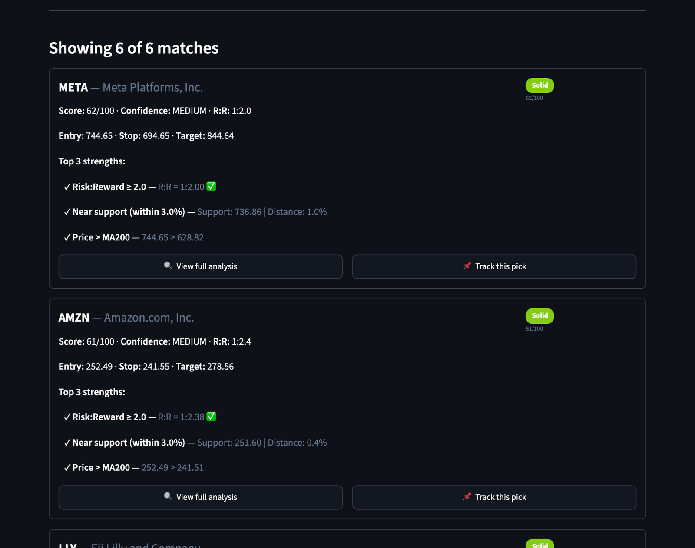
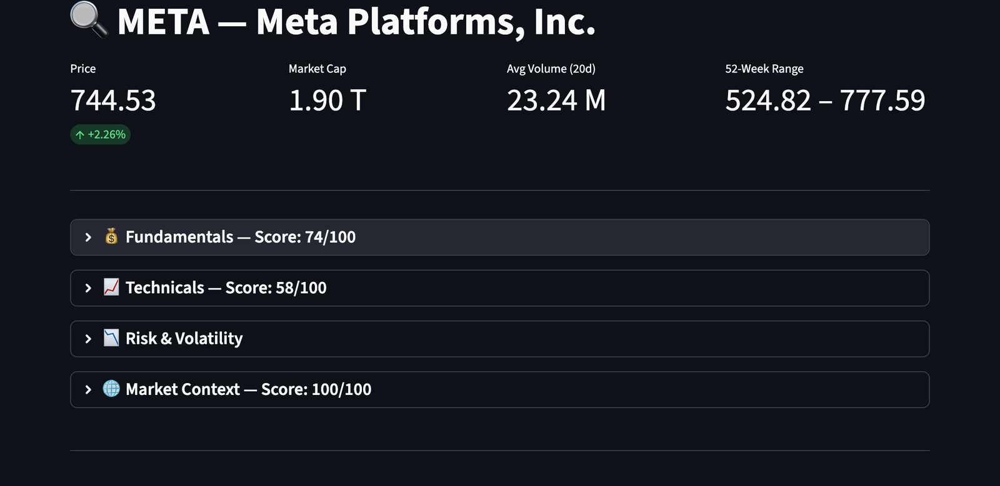
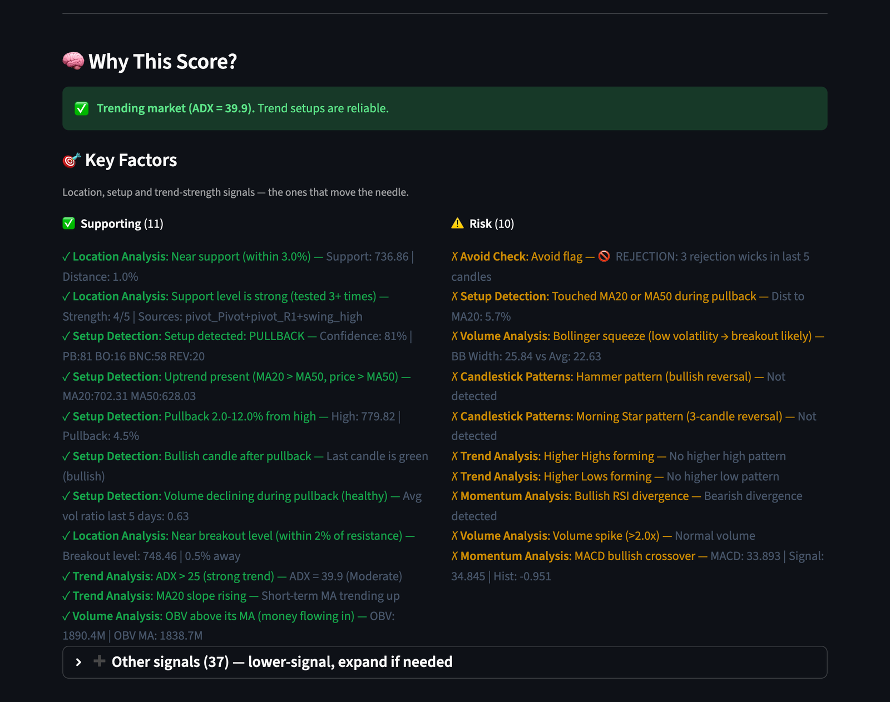
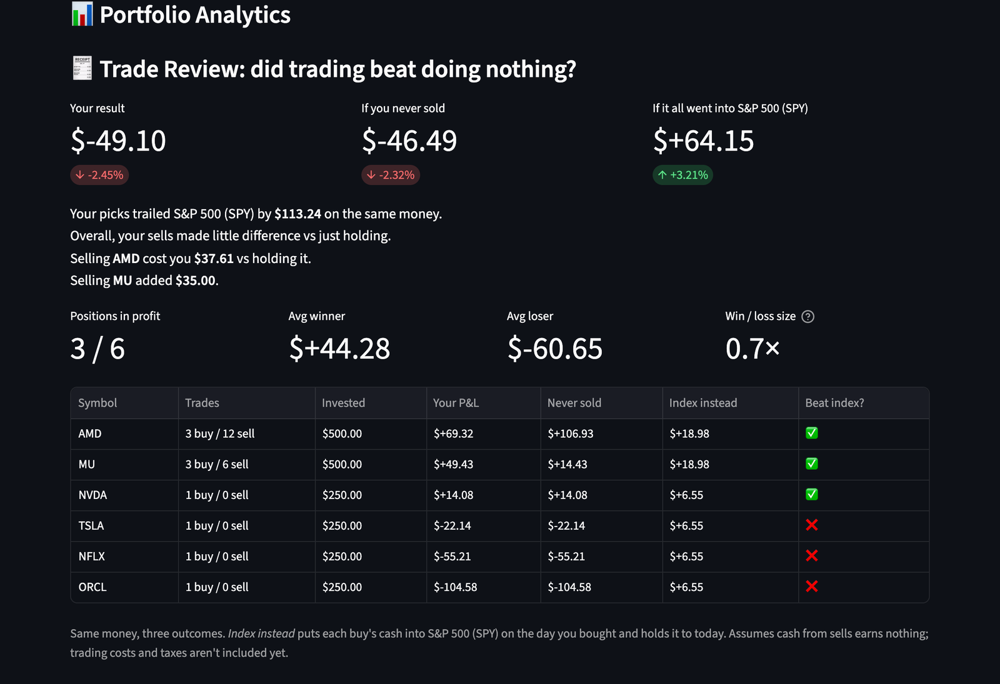
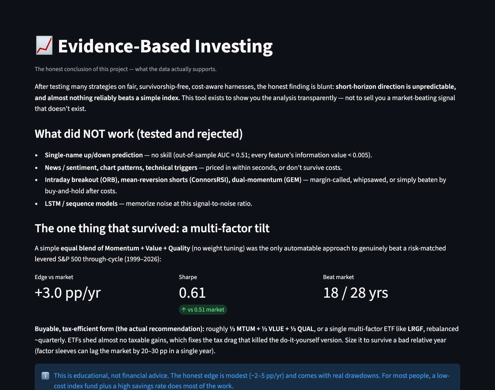

# istock

**A stock research tool that shows its work, and never tells you to buy.**

I set out to predict which way stocks would move, using news, chart signals, momentum
and machine learning. Once trading costs were counted, none of it beat a coin flip. So I
stopped trying to predict, and started measuring instead.

istock helps an analyst **before** a trade (where to look, and the case for and against)
and **after** it (did the trading actually beat doing nothing?).

---

## What it does

### 1. Shortlists the stocks worth a closer look
Every stock in the universe gets a 0–100 score and a quality band, from Poor to Excellent.
The high scorers are shortlisted with their top strengths, so you know where to look first.
It's a screener, not a buy list.



### 2. Lays out the full picture for one stock
**View full analysis** opens a breakdown of fundamentals, technicals, market context
and risk & volatility, each scored, plus a price chart with reference levels.



**Why This Score?** puts the case for and against side by side: what's supporting the
score, and what's a risk, right now.



### 3. Reviews your trades afterwards
**Trade Review** compares what you actually made with two alternatives on the same money:
never selling, and just buying the index (S&P 500 for US stocks, Nifty 50 for Indian ones).
It shows win/loss sizes, which sells helped or hurt, and which positions beat the index.



*The portfolio above is a labelled sample: a simple rule (sell half at +8%, hold losers,
buy back 5% dips) run on real closing prices. Not real trades.*

The Home page also covers the basics: today's best and worst movers, and how your money
is spread across sectors.

---

## What I tested, and what failed

Every idea got a fair test: survivorship-free data, trading costs included, and results
checked year by year so one lucky year couldn't pass as an edge.

| Idea | Result |
|---|---|
| Up/down prediction with 36 chart signals (logistic regression, LightGBM) | No skill. Out-of-sample AUC 0.51, where 0.50 is a coin flip |
| News and sentiment | Priced in within seconds |
| Chart patterns and technical triggers | The best edge was smaller than trading costs |
| Opening-range breakout | Lost money every year, even before costs |
| Mean-reversion shorts (ConnorsRSI) | Margin-called in the January 2021 meme-stock squeeze |
| Dual momentum | +30% vs the S&P 500's +371% (2008–2024) |

The one thing that held up was not a stock-picking rule: an equal mix of momentum, value
and quality factors beat a risk-matched S&P 500 by about 3 percentage points a year
(1999–2026). The full write-up is in [istock/CONCLUSIONS.md](istock/CONCLUSIONS.md).



What *is* predictable is how much a stock moves, not which way. That's why the tool
measures risk and quality instead of issuing calls.

---

## Run it

```bash
git clone https://github.com/ismailwangde/istock.git
cd istock
python3 -m venv .venv && source .venv/bin/activate
pip install -r requirements.txt
streamlit run istock/ui/app.py
```

Needs Python 3.11+ and an internet connection (prices come from Yahoo Finance).
More detail in [RUN.md](RUN.md).

## Limits

- Trade Review doesn't include trading costs or taxes yet.
- The screener scans 10 stocks by default, to keep it fast.
- Data comes from free Yahoo Finance feeds, which can be delayed or patchy.

## Built with

Python, Streamlit, pandas, yfinance, Plotly.

---

Personal project, for learning. **Not financial advice.**
